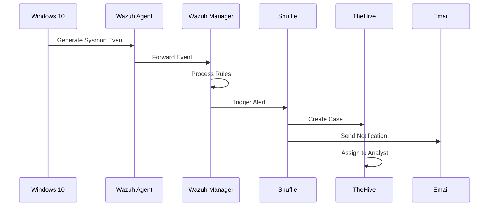
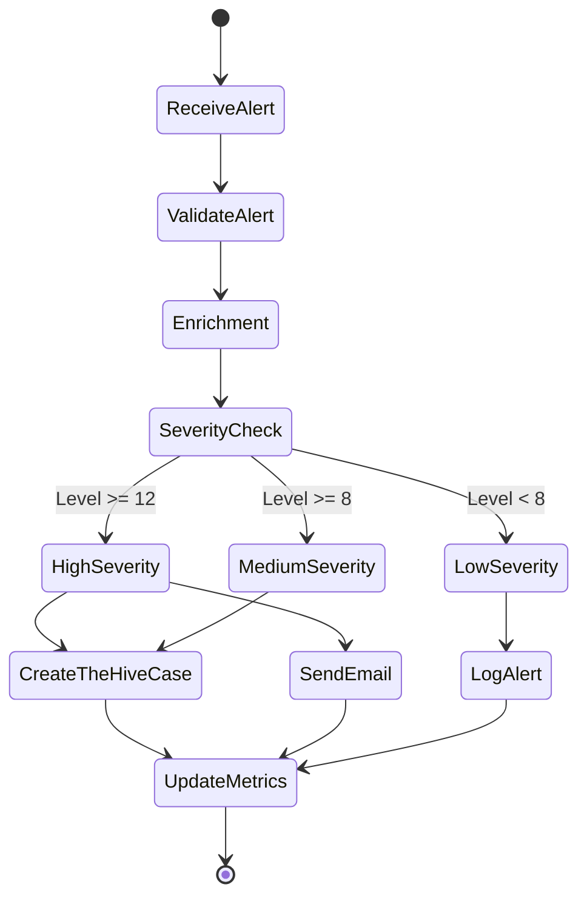
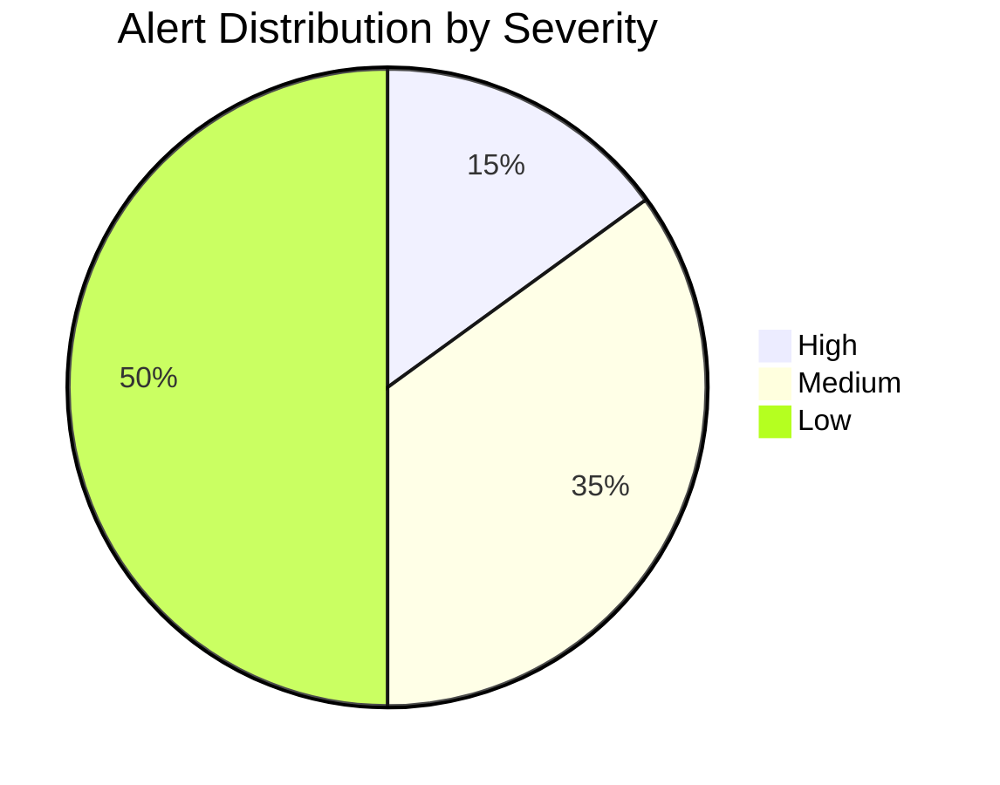
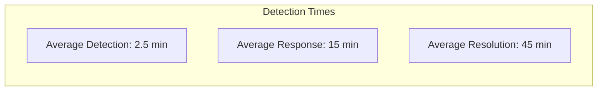
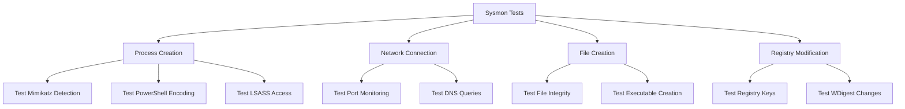

# SOC Automation Lab

## 🛡️ Overview

This project demonstrates a complete Security Operations Center (SOC) automation setup using open-source tools. The environment includes security monitoring, incident response, and automated alert handling capabilities through the integration of Wazuh SIEM, TheHive case management, and Shuffle SOAR platform.

## 🎯 Project Goals

- Implement end-to-end security monitoring and incident response
- Demonstrate automated alert handling and investigation
- Showcase integration between multiple security tools
- Generate and detect security events using common attack tools

## 🏗️ Architecture


### 💻 Network Architecture


## 🛠️ System Requirements

### Hardware Requirements
| Component | Minimum | Recommended |
|-----------|---------|-------------|
| CPU | 4 cores | 8 cores |
| RAM | 16GB | 32GB |
| Storage | 100GB | 250GB |
| Network | 1Gbps | 1Gbps |

### Software Requirements
| Component | Version | Purpose |
|-----------|---------|----------|
| Windows 10 | Enterprise 21H2+ | Endpoint |
| Ubuntu Server | 20.04 LTS | Server OS |
| Sysmon | 14.0+ | Endpoint Monitoring |
| Wazuh | 4.4+ | SIEM |
| TheHive | 5.1+ | Case Management |
| Shuffle | Latest | SOAR Platform |

## 📋 Detailed Installation Guide

### 1. Windows 10 Endpoint Configuration

#### 1.1 Sysmon Installation

```powershell
# Download Sysmon and SwiftOnSecurity config
$sysmonUrl = "https://download.sysinternals.com/files/Sysmon.zip"
$configUrl = "https://raw.githubusercontent.com/SwiftOnSecurity/sysmon-config/master/sysmonconfig-export.xml"

# Create installation directory
New-Item -ItemType Directory -Force -Path "C:\Sysmon"
Set-Location -Path "C:\Sysmon"

# Download files
Invoke-WebRequest -Uri $sysmonUrl -OutFile "Sysmon.zip"
Invoke-WebRequest -Uri $configUrl -OutFile "sysmonconfig-export.xml"

# Extract and install
Expand-Archive Sysmon.zip -DestinationPath .
.\Sysmon.exe -i sysmonconfig-export.xml

# Verify installation
Get-Service Sysmon64
Get-WinEvent -LogName "Microsoft-Windows-Sysmon/Operational" -MaxEvents 1
```

#### 1.2 Wazuh Agent Configuration

```powershell
# Download and install Wazuh agent
$wazuhAgentUrl = "https://packages.wazuh.com/4.x/windows/wazuh-agent-4.4.0-1.msi"
Invoke-WebRequest -Uri $wazuhAgentUrl -OutFile wazuh-agent.msi

# Install with specific configurations
msiexec.exe /i wazuh-agent.msi WAZUH_MANAGER="wazuh-server-ip" WAZUH_REGISTRATION_SERVER="wazuh-server-ip" WAZUH_REGISTRATION_PASSWORD="your-password" WAZUH_GROUP="windows" /q

# Configure agent
$configFile = "C:\Program Files (x86)\ossec-agent\ossec.conf"
$config = @"
<ossec_config>
  <client>
    <server>
      <address>wazuh-server-ip</address>
      <protocol>tcp</protocol>
    </server>
    <config-profile>windows, windows10</config-profile>
  </client>
  <syscheck>
    <directories check_all="yes">C:\Windows\System32\Config</directories>
    <directories check_all="yes">C:\Windows\System32\drivers</directories>
  </syscheck>
  <localfile>
    <location>Microsoft-Windows-Sysmon/Operational</location>
    <log_format>eventchannel</log_format>
  </localfile>
</ossec_config>
"@
Set-Content -Path $configFile -Value $config

# Start agent
Restart-Service -Name "Wazuh"
```

### 1.3 Sysmon Extended Configuration
```xml
<Sysmon schemaversion="4.60">
  <HashAlgorithms>md5,sha256</HashAlgorithms>
  <EventFiltering>
    <!-- Process Creation -->
    <RuleGroup name="Process Creation" groupRelation="or">
      <ProcessCreate onmatch="include">
        <Rule name="DetectMimikatz">
          <Image condition="contains">mimikatz</Image>
        </Rule>
        <Rule name="DetectSuspiciousPS">
          <CommandLine condition="contains">-enc</CommandLine>
          <CommandLine condition="contains">-encode</CommandLine>
          <CommandLine condition="contains">-decoded</CommandLine>
        </Rule>
      </ProcessCreate>
    </RuleGroup>
    
    <!-- Process Access -->
    <RuleGroup name="Process Access" groupRelation="or">
      <ProcessAccess onmatch="include">
        <TargetImage condition="end with">lsass.exe</TargetImage>
        <GrantedAccess>0x1010</GrantedAccess>
      </ProcessAccess>
    </RuleGroup>
    
    <!-- Registry Events -->
    <RuleGroup name="Registry Events" groupRelation="or">
      <RegistryEvent onmatch="include">
        <TargetObject condition="contains">WDigest</TargetObject>
        <TargetObject condition="contains">SecurityProviders</TargetObject>
      </RegistryEvent>
    </RuleGroup>
  </EventFiltering>
</Sysmon>
```

### 2. Wazuh Server Advanced Configuration

#### 2.1 Custom Detection Rules

Create `/var/ossec/etc/rules/local_rules.xml`:
```xml
<!-- Mimikatz Detection Rules -->
<group name="windows,sysmon,mimikatz">
  <!-- Process Creation -->
  <rule id="100100" level="12">
    <if_group>sysmon_event1</if_group>
    <field name="win.eventdata.originalFileName">mimikatz.exe</field>
    <description>Mimikatz execution detected</description>
    <mitre>
      <id>T1003</id>
    </mitre>
  </rule>
  
  <!-- Memory Access -->
  <rule id="100101" level="12">
    <if_group>sysmon_event10</if_group>
    <field name="win.eventdata.targetImage">lsass.exe</field>
    <description>Potential credential dumping via LSASS access</description>
    <mitre>
      <id>T1003.001</id>
    </mitre>
  </rule>
  
  <!-- Registry Modification -->
  <rule id="100102" level="10">
    <if_group>sysmon_event13</if_group>
    <field name="win.eventdata.targetObject">HKLM\SYSTEM\CurrentControlSet\Control\SecurityProviders\WDigest</field>
    <field name="win.eventdata.details">UseLogonCredential</field>
    <description>WDigest credential caching enabled - potential credential theft preparation</description>
    <mitre>
      <id>T1003.001</id>
    </mitre>
  </rule>
</group>
```

#### 2.2 Wazuh Manager Configuration

Edit `/var/ossec/etc/ossec.conf`:
```xml
<ossec_config>
  <global>
    <jsonout_output>yes</jsonout_output>
    <alerts_log>yes</alerts_log>
    <logall>no</logall>
    <memory_size>1024</memory_size>
    <queue_size>131072</queue_size>
  </global>

  <syscheck>
    <alert_new_files>yes</alert_new_files>
    <auto_ignore>no</auto_ignore>
    <scan_on_start>yes</scan_on_start>
    <frequency>43200</frequency>
  </syscheck>

  <rootcheck>
    <frequency>43200</frequency>
    <skip_nfs>yes</skip_nfs>
  </rootcheck>

  <alerts>
    <log_alert_level>3</log_alert_level>
    <email_alert_level>12</email_alert_level>
  </alerts>
</ossec_config>
```

### 2.3 Wazuh Agent Group Configuration
Create `/var/ossec/etc/shared/windows/agent.conf`:
```xml
<agent_config>
  <localfile>
    <location>Microsoft-Windows-Sysmon/Operational</location>
    <log_format>eventchannel</log_format>
    <query>Event/System[EventID != 3 and EventID != 5]</query>
  </localfile>
  
  <syscheck>
    <directories check_all="yes" realtime="yes">C:\Windows\System32\drivers</directories>
    <directories check_all="yes" realtime="yes">C:\Windows\System32\Config</directories>
    <directories check_all="yes" realtime="yes">C:\Program Files</directories>
    <ignore>C:\Program Files (x86)\ossec-agent</ignore>
    
    <windows_registry>HKEY_LOCAL_MACHINE\Software\Microsoft\Windows\CurrentVersion\Run</windows_registry>
    <windows_registry>HKEY_LOCAL_MACHINE\Software\Microsoft\Windows\CurrentVersion\RunOnce</windows_registry>
    <registry_ignore>HKEY_LOCAL_MACHINE\Software\Microsoft\Windows\CurrentVersion\Installer\UserData</registry_ignore>
  </syscheck>
  
  <rootcheck>
    <system_audit>./shared/win_audit_rcl.txt</system_audit>
    <windows_apps>./shared/win_applications_rcl.txt</windows_apps>
    <windows_malware>./shared/win_malware_rcl.txt</windows_malware>
  </rootcheck>
</agent_config>
```



### 3. TheHive Advanced Setup

#### 3.1 TheHive Configuration

Create `/etc/thehive/application.conf`:
```conf
# Secret key
play.http.secret.key="change_this_to_a_secure_key"

# Elasticsearch configuration
search {
  index {
    name = "thehive"
    replicas = 0
    shards = 5
    refresh_interval = "1s"
  }
}

elasticsearch {
  cluster.name = "hive"
  host = ["127.0.0.1:9300"]
}

# File storage configuration
storage {
  provider = localfs
  localfs.location = /opt/thp/thehive/files
}

# Authentication configuration
auth {
  providers = [
    {
      name = local
      order = 1
      config {
        caseSensitive: false
      }
    }
  ]
}

# CORS configuration
play.filters.cors {
  allowedOrigins = ["*"]
  allowedHttpMethods = ["GET", "POST", "PUT", "DELETE"]
}
```

### 4. Shuffle Integration Details

#### 4.1 Wazuh to Shuffle Webhook Configuration

Create a new Wazuh integration in `/var/ossec/etc/integrations/custom-shuffle`:
```bash
#!/bin/bash

WEBHOOK_URL="http://shuffle-ip:3001/api/v1/hooks/webhook_id"
ALERT_FILE="$1"
WEBHOOK_TYPE="$2"

if [ ! -f "$ALERT_FILE" ]; then
    echo "Alert file not found: $ALERT_FILE"
    exit 1
fi

alert_json=$(cat "$ALERT_FILE")
curl -s -X POST -H "Content-Type: application/json" -d "$alert_json" "$WEBHOOK_URL"
```

#### 4.2 Shuffle Workflow Configuration

```yaml
triggers:
  - type: webhook
    name: Wazuh Alert
    conditions:
      - field: rule.level
        operator: greater_than
        value: 10

actions:
  - type: thehive
    name: Create TheHive Alert
    parameters:
      title: "{{trigger.rule.description}}"
      description: "{{trigger.full_log}}"
      severity: "{{trigger.rule.level}}"
      tags: 
        - "wazuh"
        - "{{trigger.rule.mitre.id}}"
      
  - type: email
    name: Send Notification
    parameters:
      to: "soc@company.com"
      subject: "High Severity Alert: {{trigger.rule.description}}"
      body: |
        Alert Details:
        Description: {{trigger.rule.description}}
        Level: {{trigger.rule.level}}
        Source: {{trigger.agent.name}}
        MITRE ATT&CK: {{trigger.rule.mitre.id}}
```

### 4.3 Shuffle Advanced Workflow


## 📊 SOC Metrics Dashboard

### Alert Distribution


### Response Time Metrics


## 🧪 Integration Testing Matrix

| Component | Test Case | Expected Result | Validation Method |
|-----------|-----------|-----------------|-------------------|
| Sysmon | Process Creation | Event ID 1 Generated | Event Viewer |
| Wazuh Agent | Event Forwarding | Events in Wazuh Manager | agent_control -i |
| Custom Rules | Mimikatz Detection | Alert Level 12 | ossec-logtest |
| Shuffle | Workflow Trigger | Case Created | TheHive API Check |
| Email | Alert Notification | Email Received | Manual Verification |

## 🧪 Comprehensive Testing & Validation Procedures

### 1. Component-Level Testing

#### 1.1 Sysmon Testing Matrix


| Test Case | Command/Action | Expected Result | Validation Command |
|-----------|---------------|-----------------|-------------------|
| Process Creation | `Start-Process notepad.exe` | Event ID 1 | `Get-WinEvent -LogName Microsoft-Windows-Sysmon/Operational \| Where-Object { $_.ID -eq 1 }` |
| PowerShell Encoding | `powershell -enc VABlAHMAdAA=` | Event ID 1 with encoded command | `Get-WinEvent -FilterHashtable @{LogName='Microsoft-Windows-Sysmon/Operational';ID=1} \| Where-Object { $_.Message -like '*-enc*' }` |
| LSASS Access | Use Process Explorer to access LSASS | Event ID 10 | `Get-WinEvent -FilterHashtable @{LogName='Microsoft-Windows-Sysmon/Operational';ID=10} \| Where-Object { $_.Message -like '*lsass.exe*' }` |

## 🔍 Troubleshooting Guide

### Common Issues and Solutions

#### Windows Agent Issues
Agent not connecting:

```powershell
# Check agent status
C:\Program Files (x86)\ossec-agent\wazuh-agent.exe -t

# Verify manager IP in config
notepad C:\Program Files (x86)\ossec-agent\ossec.conf

# Check Windows Firewall
New-NetFirewallRule -DisplayName "Wazuh Agent" -Direction Outbound -LocalPort 1514 -Protocol TCP -Action Allow
```

#### Wazuh Server Issues
Rules not triggering:

```bash
# Test rule matching
/var/ossec/bin/ossec-logtest -v

# Check rule syntax
/var/ossec/bin/verify-rules-file /var/ossec/etc/rules/local_rules.xml

# Enable debug mode
echo "logtest.debug=2" >> /var/ossec/etc/internal_options.conf
```

#### TheHive Issues
Service won't start:

```bash
# Check logs
journalctl -u thehive -f

# Verify Elasticsearch
curl -X GET http://localhost:9200/_cluster/health

# Check permissions
chown -R thehive:thehive /opt/thp/thehive/files
```

#### Shuffle Issues
Workflow not executing:

```bash
# Check Docker containers
docker ps | grep shuffle

# View workflow logs
docker logs shuffle-backend

# Verify webhook URL
curl -X POST http://shuffle-ip:3001/api/v1/hooks/webhook_id -d '{"test": "data"}'
```

## 📈 Performance Monitoring

### System Health Checks

```bash
# Wazuh Manager Stats
/var/ossec/bin/agent_control -s

# TheHive Performance
curl -X GET http://localhost:9000/api/stats

# Elasticsearch Metrics
curl -X GET "localhost:9200/_cat/indices?v"
```

## 🔄 Backup Procedures

### Wazuh Backup

```bash
# Stop Wazuh
systemctl stop wazuh-manager

# Backup configuration
tar -czf wazuh-config-backup.tar.gz /var/ossec/etc/

# Start Wazuh
systemctl start wazuh-manager
```

### TheHive Backup

```bash
# Stop TheHive
systemctl stop thehive

# Backup data
elasticdump --input=http://localhost:9200/thehive --output=thehive-backup.json

# Start TheHive
systemctl start thehive
```

## 📊 Metrics & KPIs

### Security Metrics Dashboard


## 🎓 Advanced Learning Resources

- [Wazuh Documentation](https://documentation.wazuh.com)
- [TheHive Project Documentation](https://docs.thehive-project.org)
- [Shuffle Documentation](https://shuffler.io/docs)
- [MITRE ATT&CK Framework](https://attack.mitre.org)


---
